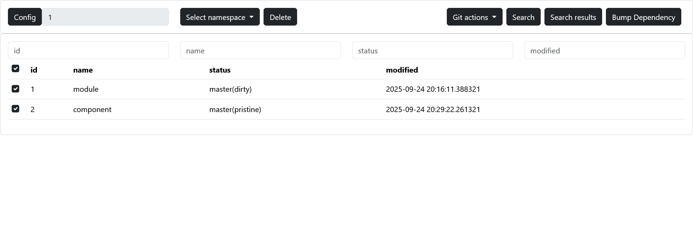
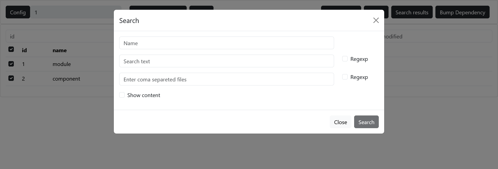

# Gitlab Projects Manager

## Prerequisites

Python minimum 3.10.6 

FastAPI + fastapi-camelcase

## Description

Main functionalities:
- via gitlab REST API re-create group(with all subgroups and projects) in json format with metadata eq name, url
- using this data you can
  - clone all projects into local machine
  - pull changes to be up-to-date
  - search for text/regexp in projects
  - bump dependency(via property in pom.xml)


## Configuration

Change name of `config.json.sample` to `config.json` and provide url to gitlab, your token, group id of space in gitlab,
providers you want to use and other specific configuration.

```json
{
  "git": {
    "url": "https://gitlab",
    "access_token": "",
    "default_branch": "master"
  },
  "project": {
    "group_id": "123",
    "excluded": {
      "archived": ["True"],
      "namespace": ["company/components"]
    },
    "included": {
      "archived": ["False"],
      "namespace": ["company/components"]
    }
  },
  "providers": {
    "ui": ["id", "name"],
    "loader":  ["id", "archived", "namespace", "ssh", "url", "name"]
  },
  "management": {
    "directory": "/path"
  }
}
```

## Usage

### CLI

```shell
python cli_entry_point.py
```
examples:
```shell
python cli_entry_point.py --action=load
python cli_entry_point.py --action=clone
python cli_entry_point.py --action=pull --project-name=exmaple
python cli_entry_point.py --action=status --status-file=status-{timestamp}.csv
python cli_entry_point.py --action=search --search-text=sample --search-regex=sample --file-text=.txt --file-regex=sample --show-content
```

for more information
```shell
python cli_entry_point.py --help
```

### Web interface

```shell
fastapi run http_entry_point.py
```

go to 127.0.0.1:8000 





## Customization

Customize your registered providers in providers_implementation, any file *.py will be scanned.
Register own provider via decorator:

```python
@add_provider('sample')
def sample_provider(project):
    # your logic
    return {} | ""
```

To read configuration use `read_configuration(str)`.

# Example

config.json

```json
{
  "git": {
    "url": "https://gitlab",
    "access_token": "__authtoken__",
    "default_branch": "master"
  },
  "project": {
    "group_id": "1000",
    "excluded": {
      "archived": ["False"],
      "namespace": []
    }
  },
  "providers": {
    "ui": ["id", "name"],
    "loader":  ["id", "archived", "namespace", "ssh", "url", "name"]
  },
  "management": {
    "directory": "/path"
  }
}
```

Gitlab projects structure:

```text

- company/namespace
    - components
        - sample-component
    - modules
        - sample
            - sample-api
            - sample-module
```

Result:

```json
[
  {
    "archived": "False",
    "namespace": "company/namespace/modules/sample",
    "ssh": "ssh://git@gitlab.com:2222/company/namespace/modules/sample/sample-api.git",
    "url": "https://gitlab.com/company/namespace/modules/sample/sample-api",
    "name": "sample-api"
  },
  {
    "archived": "False",
    "namespace": "company/namespace/modules/sample",
    "ssh": "ssh://git@gitlab.com:2222/company/namespace/modules/sample/sample-module.git",
    "url": "https://gitlab.com/company/namespace/modules/sample/sample-module",
    "name": "sample-module"
  },
  {
    "archived": "False",
    "namespace": "company/namespace/components",
    "ssh": "ssh://git@gitlab.com:2222/company/namespace/components/sample-component.git",
    "url": "https://gitlab.com/company/namespace/components/sample-component",
    "name": "sample-component"
  }
]
```